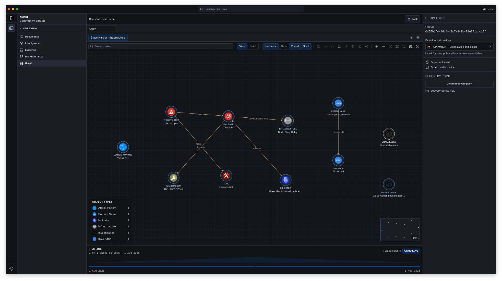
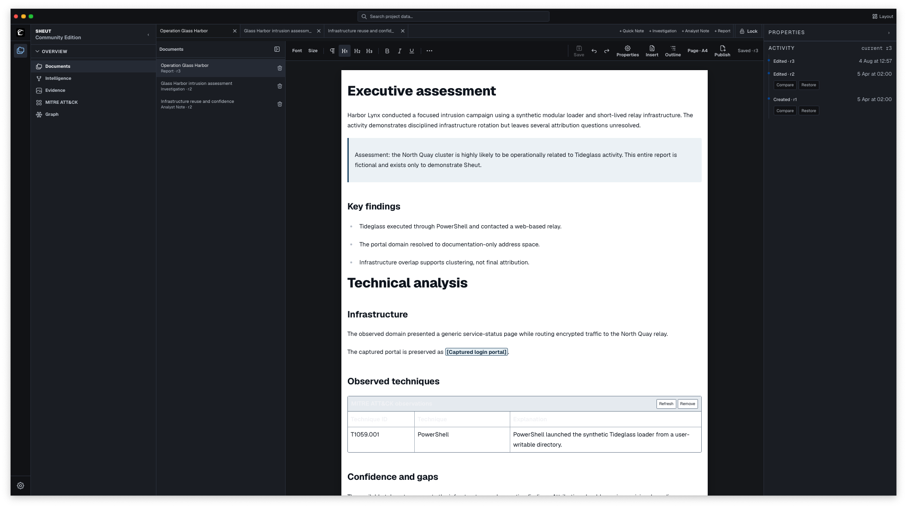
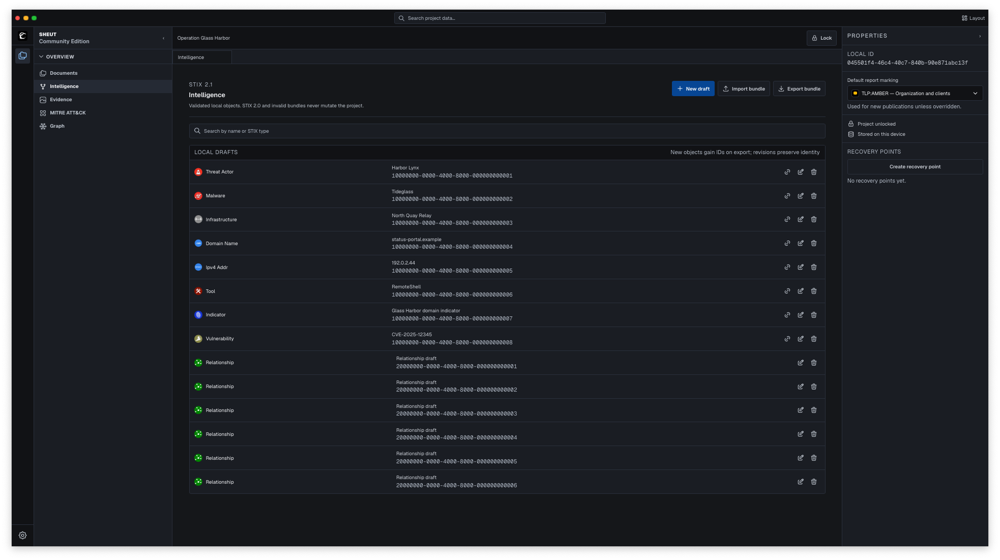
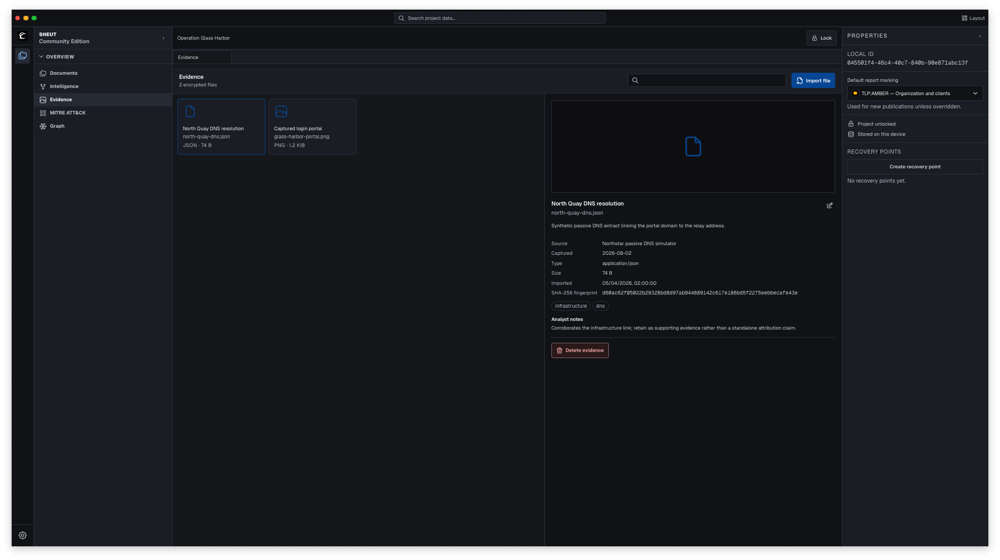
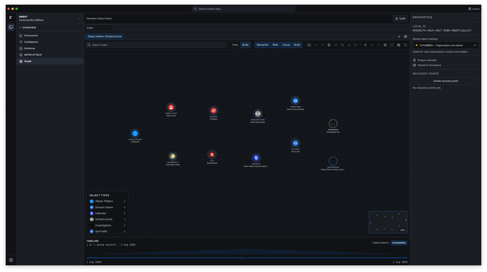
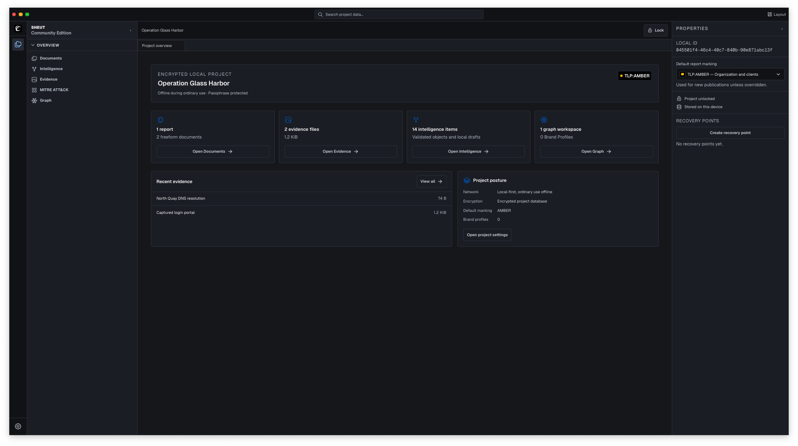

<p align="center">
  <a href="https://github.com/PerceptraHQ/sheut-community/actions/workflows/ci.yml"></a>
  <a href="https://github.com/PerceptraHQ/sheut-community/actions/workflows/codeql.yml"></a>
  <a href="https://github.com/PerceptraHQ/sheut-community/actions/workflows/rust-audit.yml"></a>
  <a href="SECURITY.md"></a>
  <a href="LICENSE"></a>
  
  
</p>

<p align="center">
  A local-first cyber threat intelligence workbench by <strong>PerceptraHQ</strong>.
</p>

## Introduction

Sheut is a local-first desktop workbench for cyber threat intelligence. It
brings evidence, STIX 2.1, ATT&CK observations, graph analysis, writing, and PDF
reporting into one encrypted project—without making analysts work in raw JSON.

## Screenshots



<p align="center">
  
  
</p>

<p align="center">
  
  
</p>



> [!WARNING]
> Sheut is early alpha software and is not ready for operational intelligence.
> macOS is the manually tested platform for `0.1.0-alpha`; Windows and Linux
> builds are currently previews.

## From evidence to a finished report

Sheut keeps the whole investigation connected:

- Build and revise full STIX 2.1 intelligence through readable forms.
- Import and export STIX Bundles without discarding unknown extension data.
- Preserve evidence with source details, hashes, tags, and analyst notes.
- Record Enterprise, Mobile, and ICS ATT&CK or ATLAS observations offline.
- Explore semantic relationships, references, and analyst links on a graph.
- Write revisioned investigations, analyst notes, and reports in one editor.
- Generate polished PDF reports with frontmatter, a table of contents, page
  furniture, figures, and a deterministic evidence appendix.

Visual links never silently become STIX Relationship objects. Drafts retain
stable local identities, and standards-compliant STIX IDs are created only
during explicit validation and export.

## Reports without the forms

Reports start as blank documents. There are no templates, readiness checklists,
or forced sections. A4 and Letter previews show the actual writing space;
headings build the outline and PDF table of contents; explicit page breaks stay
under the analyst's control.

Evidence citations and figures, frozen project references, ATT&CK observations,
and graph snapshots can be inserted directly from the project. They refresh
only when the analyst asks, so upstream edits never rewrite a report silently.

The generated PDF includes the cover, report administration, optional release
history, nested contents, TLP markings, page numbers, body, analytical figures,
and evidence appendix. Report publication is PDF-only.

## Local means local

Each project has its own encrypted database, recovery points, and portable
backups. Unlock with the operating system credential store or an
Argon2id-protected passphrase. Ordinary work needs no account, subscription,
telemetry, or project-data network traffic.

React never opens SQLite, reads the filesystem, or handles encryption keys.
Typed Tauri commands cross into Rust, which owns validation, paths,
transactions, migrations, persistence, recovery, import, export, and
publication. Project data and every command argument are treated as untrusted.

## Community is the product

This repository contains **Sheut Community** under MPL-2.0. Local encryption,
recovery, STIX and JSON portability, evidence handling, graph analysis,
document editing, and PDF reporting stay in Community.

Enterprise adds maintained external connectors, collaboration, SSO/RBAC,
organization policy, managed backups, and centralized key management. Security
fixes and ownership of local data are never paid features.

## Development

You need Rust `1.97.1`, Node.js `24.18.0`, Corepack, and the current
[Tauri platform dependencies](https://v2.tauri.app/start/prerequisites/).

```sh
corepack enable
corepack pnpm install --frozen-lockfile
corepack pnpm check
corepack pnpm tauri:dev
```

`corepack pnpm check:push` runs the full local gate and JavaScript advisory
audit. See [CONTRIBUTING.md](CONTRIBUTING.md) before opening a pull request and
report vulnerabilities through the private process in
[SECURITY.md](SECURITY.md).

## License

Sheut Community is licensed under the [Mozilla Public License 2.0](LICENSE).
Bundled catalog and asset notices are listed in
[THIRD_PARTY_NOTICES.md](THIRD_PARTY_NOTICES.md).
