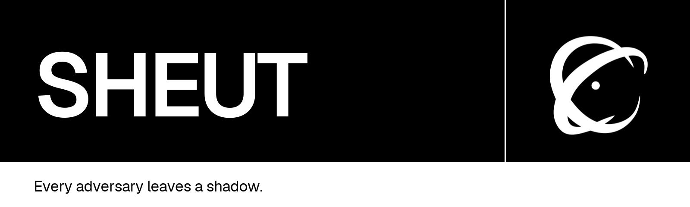

<p align="center">
  <a href="https://github.com/PerceptraHQ/sheut-community/actions/workflows/ci.yml"></a>
  <a href="https://github.com/PerceptraHQ/sheut-community/actions/workflows/codeql.yml"></a>
  <a href="https://github.com/PerceptraHQ/sheut-community/actions/workflows/rust-audit.yml"></a>
  <a href="SECURITY.md"></a>
  <a href="LICENSE"></a>
  
  
</p>

<p align="center">
  A local-first cyber threat intelligence workbench by <strong>PerceptraHQ</strong>.
</p>

Sheut turns fragmented evidence into structured, traceable intelligence without
making analysts operate on raw STIX JSON or Markdown. The desktop application
brings guided STIX authoring, visual investigations, and WYSIWYG reporting into
one offline-capable workspace. Sheut targets macOS, Windows, and Linux desktops;
Android and iOS applications are outside the product scope.

> [!WARNING]
> Sheut is early alpha software and is not ready for operational
> intelligence.

For `0.1.0-alpha`, macOS is the manually qualified packaged runtime. Windows
and Linux artifacts are CI-built previews and will be labelled as not manually
verified until suitable platform testing is available.

## Community, not a demo

This public repository contains **Sheut Community**, licensed under MPL-2.0.
The Community product is intended to remain a complete local CTI workstation:

- encrypted local projects and recovery;
- guided STIX 2.1 authoring and lossless import/export;
- a visual investigation builder;
- WYSIWYG investigations and analyst notes plus guided, template-driven reports;
- local search, timelines, and portable project data; and
- no account, subscription, telemetry, or project-data network traffic for
  ordinary local use.

Maintained external integrations, collaboration, team servers, SSO/RBAC,
organization policy, centralized KMS, and managed operations belong to the
private `PerceptraHQ/sheut-enterprise` repository. Security, encryption,
recovery, and data portability are never paywalled.

## Technology stack

| Layer       | Choice                      | Boundary                                                        |
| ----------- | --------------------------- | --------------------------------------------------------------- |
| Desktop     | Tauri 2                     | Minimal capabilities; no app-side MCP bridge                    |
| Interface   | React 19 + TypeScript       | Never receives database keys or raw SQL/filesystem access       |
| Core        | Rust 1.97.1                 | Validation, transactions, persistence, import, export, recovery |
| Storage     | SQLCipher-compatible SQLite | Encrypted projects, migrations, backups, and recovery           |
| Documents   | Versioned structured JSON   | WYSIWYG source of truth; never raw HTML or Markdown             |
| Interchange | STIX 2.1                    | Validated import/export contract, not the internal draft model  |
| Knowledge   | MITRE ATT&CK + ATLAS        | Hash-verified snapshots bundled for offline use                 |

The interface uses Tailwind CSS 4 with its Typography plugin, Base UI,
self-hosted Geist and Geist Mono variable fonts, and Tabler Icons 3.46.0.
Official OASIS STIX pictograms are reserved for STIX graph
objects rather than general interface controls. The investigation editor uses
Tiptap 3.29.2 behind a lazy boundary. The graph workspace uses exact-pinned
modular D3 packages, a high-DPI Canvas/DOM hybrid, a deterministic one-shot
layout worker, and Zustand 5.0.14; React Flow is deliberately not used. Sheut
owns its schemas, semantics, accessibility, and interface rather than adopting
an editor or graph library's domain model. Ordinary layout uses Tailwind
utilities; shared semantic skins, Base UI state selectors, and Tiptap
descendant styles remain in the stylesheet where reuse is clearer than
repeated JSX. The lazy command palette uses exact-pinned `cmdk` 1.1.1 inside a
Base UI dialog frame; Sheut does not initialize shadcn or ship global shadcn
CSS.

## Development

Prerequisites are Rust `1.97.1`, Node.js `24.18.0`, Corepack, and the current
[Tauri platform dependencies](https://v2.tauri.app/start/prerequisites/). The
repository pins pnpm and all direct JavaScript dependencies.

```sh
corepack enable
corepack pnpm install --frozen-lockfile
corepack pnpm check
corepack pnpm tauri:dev
```

| Command                             | Purpose                                               |
| ----------------------------------- | ----------------------------------------------------- |
| `corepack pnpm check`               | Format, lint, type-check, test, and build JS and Rust |
| `corepack pnpm check:push`          | Full local gate plus the JavaScript advisory audit    |
| `corepack pnpm check:release`       | Push gate plus live MITRE release freshness checks    |
| `corepack pnpm test`                | Run frontend tests serially with one worker           |
| `corepack pnpm test:rust`           | Run the complete Rust workspace test suite            |
| `corepack pnpm test:watch`          | Run focused frontend tests while developing           |
| `corepack pnpm tauri:dev`           | Launch the Community desktop application              |
| `corepack pnpm icons:desktop`       | Regenerate native icons from `src/assets/sheut-logo.svg` |

Git hooks format and lint staged files, enforce Conventional Commits, and run
the push gate. Dependency lifecycle scripts are denied unless explicitly
reviewed in `pnpm-workspace.yaml`.

## Architecture and safety

Start with the [product specification](docs/product-spec.md),
[architecture](docs/architecture.md), and [security model](docs/security.md).

The React frontend uses narrow typed Tauri commands. Rust owns validation and
persistence. Project content, imported intelligence, rich documents,
attachments, paths, and every command argument are untrusted. No project
contents, credentials, encryption keys, or intelligence values enter logs.

Report vulnerabilities through GitHub's private security-advisory flow as
described in [`SECURITY.md`](SECURITY.md). Never put real intelligence or
credentials in a public issue.

## Included in 0.1.0-alpha

### Local projects and security

- SQLCipher-encrypted projects with independent random keys, device
  credential-store unlock, optional Argon2id passphrase unlock, encrypted
  backups, recovery points, and wrong-key/corruption checks.
- Rust-owned paths, native dialogs, migrations, transactions, import/export,
  deletion, and restore. React receives typed results rather than filesystem or
  database access.
- Explicit Tauri command capabilities, IPC isolation, restrictive CSP and
  headers, no telemetry, and no ordinary project-data network traffic.

### Intelligence and evidence

- Structured STIX 2.1 drafts, lossless bounded Bundle import/export, readable
  relationships and references, and explicit conversion from visual links to
  semantic relationship drafts.
- Project-scoped Enterprise ATT&CK 19.1, Mobile 19.1, ICS 19.1, and ATLAS
  2026.06 catalogs with encrypted observations and compatible mapping/Navigator
  interchange.
- Encrypted evidence for images, video, documents, and inert archives, with
  analyst metadata, previews, report references, and deterministic appendix
  labels.

### Documents, reports, and publication

- Revisioned investigations and analyst notes stored as structured JSON, with
  autosave, rich-text editing, safe links, indicator defanging, tables,
  callouts, image attachments, comparison, restore, and recoverable deletion.
- Guided Threat Actor Profile, Intrusion Analysis, Campaign, Executive, Blank,
  and [Illicit Ecosystem](docs/illicit-ecosystem-report-guide.md) reports with
  typed fields, manual sections, project-data references, validation, revisions,
  and generated project-local Report IDs.
- Revisioned Brand Profiles and one validated publication pipeline for offline
  standalone HTML, editable DOCX, and direct Typst PDF. Publication snapshots
  preserve paper, orientation, TLP, branding, included sections, appendices,
  page furniture, version, and status.

### Desktop workflow

- Accessible Base UI workspaces, collapsible explorers, closable tabs, command
  palette, context menus, native application menu, keyboard shortcuts, Zen and
  fullscreen modes, Settings, help guides, and third-party notices.
- Responsive editors and publication dialogs designed for the 960-pixel desktop
  minimum. A reproducible production-bundle measurement keeps ordinary editor
  readiness within the 500 ms reference budget.

The full release history is in [`CHANGELOG.md`](CHANGELOG.md). Required license
and catalog notices ship in
[`THIRD_PARTY_NOTICES.md`](THIRD_PARTY_NOTICES.md).

## Contributing

Read [`CONTRIBUTING.md`](CONTRIBUTING.md) and the
[`CODE_OF_CONDUCT.md`](CODE_OF_CONDUCT.md). Pull requests must pass the pinned
quality, dependency, and security workflows before merge to protected `main`.

## License

Sheut Community is licensed under the [Mozilla Public License 2.0](LICENSE).
Copyright belongs to PerceptraHQ and individual contributors as applicable.
Bundled MITRE catalog notices are reproduced in
[`THIRD_PARTY_NOTICES.md`](THIRD_PARTY_NOTICES.md).
